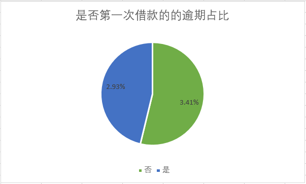
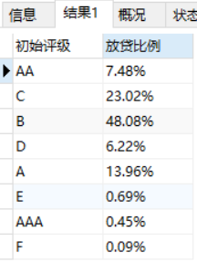

[TOC]


## 一.背景描述

互联网金融行业，逾期率一直是影响其发展的主要原因，所以如何通过现有的数据分析逾期用户画像来进行客户筛选就显得格外重要，通过各个不同维度分析不良贷款情况，以及放贷比例，从而为企业更好的做决策提供参考意见。
## 二.业务指标
金融行业风险业务指标尤为关键。风险业务指标包括：逾期天数DPD、逾期期数、逾期阶段、即期指标、递延指标、月底结算、期末结算、延滞率、不良贷款率、转呆账率、净损失率、FPD（首次还款逾期）。


## 三.数据描述
第三方某信贷公司，所提供数据包含了成交时间从2015年1月1日到2017年1月30日的信用标。
本次分析只是采用的其中10%的样本进行分析，共328553只标。
标的特征表，每支标一条记录。共有37个字段，包括一个主键、15个标的特征和21个成交当时的借款人信息，全部为成交当时可以获得的信息。


## 四.提出问题

#### 4.1 用户维度
> * 失信用户画像：初始认证等级、年龄、性别、学历等维度的逾期占比分布情况；
> * 失信用户行为分析：是否开淘宝店；是否有征信报告；是否完成本人认证；是否第一次借款；

#### 4.2 业务维度
> * 不良贷款率随记录时间变化趋势
>
> * 不良贷款率与年龄、性别之间的相关性分析，以及各年龄段、性别的放贷比列；
>
> * 不良贷款率与初始评级之间的相关性分析，以及初始评级的放贷比列；
>
> * 不良贷款率与借款类型、利率、金额、期限之间的相关性分析，以及放贷比例；
>
>   


基于以上信息，我从用户画像以及不良贷款率两个业务指标出发，按照以下思路进行分析。

选择以下16个维度对数据进行分析：借款金额、借款期限、借款利率、初始评级、借款类型、是否首标、年龄、性别、手机认证、户口认证、视频认证、学历认证、征信认证、淘宝认证、标当前逾期天数、待还本金。


## 五.数据清洗

#### 5.1 数据导入数据库

```mysql
终端执行数据导入语句
load data infile 'C:/ProgramData/MySQL/MySQL Server 8.0/Data/LCIS.csv'
into table LCIS
fields terminated by ','
lines terminated by '\n'
ignore 1 lines;
```

#### 5.2 字段重命名

```mysql
alter table lcis change ListingId 客户编号 char(10);
alter table lcis change recorddate 记录日期 date;
```

将英文字段 ListiingId,recorddate 改为中文字段，方便后面sql查询.

#### 5.3 缺失值,重复值处理

```mysql
#查看重复值
select 记录时间,count(*),count(distinct 客户编号),count(客户编号),count(借款金额),
count(借款期限),count(借款利率),count(初始评级),count(借款类型),count(是否首标),
count(年龄),count(性别),count(手机认证),count(户口认证),count(视频认证),count(学历认证),
count(征信认证),count(淘宝认证),count(标当前逾期天数),count(待还本金),count(记录时间)
from lcis
group by 记录时间
order by 记录时间
```


将数据通过对记录时间特征进行分组，统计每个时间段的特征统计值，发现2016-09-30时间段的 ‘count(distinct)客户编号’ 比其余特征统计值少了106个数据，说明在该时间段存在106个重复值，可以对这106个重复值进行去重操作。

```mysql
#去除重复值和缺失值
CREATE TABLE lcisnew as (SELECT DISTINCT * from lcis);
#查看结果
select 记录时间,count(*),count(distinct 客户编号),count(客户编号),count(借款金额),
count(借款期限),count(借款利率),count(初始评级),count(借款类型),count(是否首标),
count(年龄),count(性别),count(手机认证),count(户口认证),count(视频认证),count(学历认证),
count(征信认证),count(淘宝认证),count(标当前逾期天数),count(待还本金),count(记录时间)
from lcisnew
group by 记录时间
order by 记录时间;
```


执行上述sql语句，删除重复值和缺失值

#### 5.4 异常值处理

经过检查发现 户口认证、手机认证、记录时间有存在异常值

```mysql
DELETE from lcisnew where 户口认证 not in ('未成功认证','成功认证') 
or 手机认证 not in ('未成功认证','成功认证') 
or 记录时间 not in ('2016-09-30','2016-10-31','2016-11-30','2016-12-31','2017-02-28')
```

执行上述语句删除异常值

```mysql
select count(*) from lcisnew
```

删除异常值之后可以得到 lcisnew 的样本数量为291230

## 六.数据分析

#### 6.1 用户维度

**逾期用户画像分析用户的基本信息，包括初始认证等级、年龄、性别、学历分布情况**

1.初始评级逾期占比分布

```mysql
SELECT 初始评级,
初始评级逾期数量,
初始评级总数,
CONCAT(ROUND(初始评级逾期数量*100/初始评级总数,0),'%') AS '逾期占比'
FROM
(SELECT
初始评级,
sum(case when 标当前逾期天数>0 THEN 1 ELSE 0 END) as '初始评级逾期数量',
sum(case when 标当前逾期天数>0 OR 标当前逾期天数=0 THEN 1 ELSE 0 END) AS '初始评级总数'
FROM lcisnew
GROUP BY 初始评级
) as a
```


从上图表中可以得出结论：

评级为E的逾期占比最大，其次是D、F、C，而AAA和AA级则基本上没有逾期状况发生。


2.年龄段逾期占比分布

```mysql
SELECT a.年龄段,a.年龄段逾期人数,b.年龄段总人数,
concat(round(a.年龄段逾期人数*100/b.年龄段总人数,2),'%') as '逾期占比'FROM 
(SELECT 
(case when(年龄>=18 and 年龄<22) then '18-22'
when 年龄<28 then '22-28'
when 年龄<35 then '28-35'
when 年龄<42 then '35-42'
when 年龄<50 then '42-50'
when 年龄>=50 then '>=50'
ELSE 年龄 END) as 年龄段,
count('年龄段') as '年龄段逾期人数'
from lcisnew 
where 标当前逾期天数>0
GROUP BY 年龄段) as a INNER JOIN 
(SELECT 
(case when(年龄>=18 and 年龄<22) then '18-22'
when 年龄<28 then '22-28'
when 年龄<35 then '28-35'
when 年龄<42 then '35-42'
when 年龄<50 then '42,50'
when 年龄>=50 then '>=50'
ELSE 年龄 END) as 年龄段,
count('年龄段') as '年龄段总人数'
from lcisnew
GROUP BY 年龄段) as b
on a.年龄段=b.年龄段
```


从上图表得知，

根据对年龄层进行分段，各年龄段的逾期率相对比较平均，但是不同年龄段还是存在着差异；

①18-22 年龄段的用户的使用贷款的人数较少，且逾期率也最高；此类年龄段的年轻人贷款人数少可能由于信用意识不强，还款能力弱，导致能贷到款的人不多，就算能贷到逾期率也高；此类用户并非主力用户，应该尽量降低额度，甚至减少批款。

②大于50岁年龄段的用户使用贷款的人数也是远远低于其余年龄段，同时其逾期率也是最低，可以看出此类用户偏向于保守，接受贷款方式的少，此类用户虽然逾期率低，但是也并非主力用户；

③22-35 年龄段的用户使用贷款的人数占总人数75%左右，逾期率也处于比较低的水平，此类用户正处于事业期阶段，还款能力强，信用意识也比较高，所以此类用户应该算是主力用户；


3.性别逾期占比分布

```mysql
SELECT 性别,
逾期数量,
总数,
CONCAT( ROUND(逾期数量*100/总数,2),'%') as '逾期占比'
FROM
(SELECT 性别,
sum(CASE WHEN 标当前逾期天数 > 0 then 1 else 0 END) as '逾期数量',
sum(CASE WHEN 标当前逾期天数 >= 0 then 1 else 0 END) as '总数'
from lcisnew
GROUP BY 性别) as a 
```


从上图可知，男女性别逾期占比，男生的占比较高，为3.56%，女生占比较低，为2.81%；

（分析男女不同评级的逾期占比分布）


4.学历逾期占比分布

```mysql
SELECT 学历认证,
学历认证逾期数量,
学历认证总数,
CONCAT( ROUND(学历认证逾期数量*100/学历认证总数,2),'%') as '逾期占比'
FROM
(SELECT 学历认证,
sum(CASE WHEN 标当前逾期天数 > 0 then 1 else 0 END) as '学历认证逾期数量',
sum(CASE WHEN 标当前逾期天数 >= 0 then 1 else 0 END) as '学历认证总数'
from lcisnew
GROUP BY 学历认证) as a 
```


从上表可知，

未成功认证学历的用户逾期率更高，为3.90%，成功认证学历的用户逾期率较低，为2.71%；

**逾期用户画像分析用户行为，包括淘宝认证、征信认证、手机认证、视频认证、户口认证、是否第一次借款分布情况**

1.淘宝认证

```mysql
SELECT 淘宝认证,
逾期数量,
总数,
CONCAT( ROUND(逾期数量*100/总数,2),'%') as '逾期占比'
FROM
(SELECT 淘宝认证,
sum(CASE WHEN 标当前逾期天数 > 0 then 1 else 0 END) as '逾期数量',
sum(CASE WHEN 标当前逾期天数 >= 0 then 1 else 0 END) as '总数'
from lcisnew
GROUP BY 淘宝认证) as a
```


2.征信认证

```mysql
SELECT 征信认证,
逾期数量,
总数,
CONCAT( ROUND(逾期数量*100/总数,2),'%') as '逾期占比'
FROM
(SELECT 征信认证,
sum(CASE WHEN 标当前逾期天数 > 0 then 1 else 0 END) as '逾期数量',
sum(CASE WHEN 标当前逾期天数 >= 0 then 1 else 0 END) as '总数'
from lcisnew
GROUP BY 征信认证) as a
```


从上图表可知，

未进行征信认证的用户占大多数，

3.手机认证

```mysql
SELECT 手机认证,
逾期数量,
总数,
CONCAT( ROUND(逾期数量*100/总数,2),'%') as '逾期占比'
FROM
(SELECT 手机认证,
sum(CASE WHEN 标当前逾期天数 > 0 then 1 else 0 END) as '逾期数量',
sum(CASE WHEN 标当前逾期天数 >= 0 then 1 else 0 END) as '总数'
from lcisnew
GROUP BY 手机认证) as a
```


4.视频认证

```mysql
SELECT 视频认证,
逾期数量,
总数,
CONCAT( ROUND(逾期数量*100/总数,2),'%') as '逾期占比'
FROM
(SELECT 视频认证,
sum(CASE WHEN 标当前逾期天数 > 0 then 1 else 0 END) as '逾期数量',
sum(CASE WHEN 标当前逾期天数 >= 0 then 1 else 0 END) as '总数'
from lcisnew
GROUP BY 视频认证) as a
```


5.户口认证

```mysql
SELECT 户口认证,
逾期数量,
总数,
CONCAT( ROUND(逾期数量*100/总数,2),'%') as '逾期占比'
FROM
(SELECT 户口认证,
sum(CASE WHEN 标当前逾期天数 > 0 then 1 else 0 END) as '逾期数量',
sum(CASE WHEN 标当前逾期天数 >= 0 then 1 else 0 END) as '总数'
from lcisnew
GROUP BY 户口认证) as a
```


6.是否第一次借款

```mysql
SELECT 是否首标,
逾期数量,
总数,
CONCAT( ROUND(逾期数量*100/总数,2),'%') as '逾期占比'
FROM
(SELECT 是否首标,
sum(CASE WHEN 标当前逾期天数 > 0 then 1 else 0 END) as '逾期数量',
sum(CASE WHEN 标当前逾期天数 >= 0 then 1 else 0 END) as '总数'
from lcisnew
GROUP BY 是否首标) as a
```





对以上五个用户行为维度进行可视化


通过对比以上用户行为的六个维度可知，

已完成淘宝验证的逾期率小于没有完成淘宝验证的，此结果符合正常猜想，如果开过淘宝网店的用户一般会更加重视其信用评价，此用户行为符合对应的较低逾期率。第一次借款的逾期率也低于不是第一次借款的，这也是符合常规猜想的。

但是征信、视频、户口完成认证的逾期率却高于没有完成认证的逾期率，其中完成征信认证的逾期率远大于未完成认证的，这几个用户行为的逾期率结果不符合常规猜想，所以尝试寻找产生该结果的原因。


从以上表格结果可知，征信、视频、户口未认证的用户数量占比都在90%以上，逾期占比=逾期数/总数，由此可知

未认证的用户数量基数大，逾期数对于基数大的反应不灵敏，导致未成功认证的逾期率小于成功认证的逾期率。


#### 6.2业务维度

**不良贷款率随记录时间变化趋势**

```mysql
SELECT 记录时间,逾期待还金额,待还总金额,
CONCAT(round(逾期待还金额*100/待还总金额,2),'%') as '不良率'
from 
(SELECT 记录时间,
round(sum(case when 标当前逾期天数>0 then 待还本金 ELSE 0 END),2) as '逾期待还金额',
round(sum(待还本金),2) as '待还总金额'
from lcisnew 
GROUP BY 记录时间) as a
```


由图表可知，

本次数据记录的时间是从2016/9/1到2017/2/1的不良贷款率信息，不良率基本上是逐月递增，直到2017/2/1达到最高7.38%。该现象产生的原因刚好与2016年下半年p2p暴雷情况逐步发生，很多借款人都是多头借贷，出现暴雷后，很多多头借贷的借款人，没办法借新还旧，连环效应影响了更多平台。加上国家出台严格监管手段，放款速度放缓，不良率升高。


**不良贷款率与年龄、性别之间的相关性分析，以及各年龄段、性别的放贷比列；**

1.不良贷款率与性别、年龄段的相关性 

```mysql
#不良贷款与性别的相关性
SELECT 性别,逾期待还本金,待还总金额,
concat(round(逾期待还本金*100/待还总金额,2),'%') as '不良率'
from 
(SELECT 性别,
round(sum(case when 标当前逾期天数>0 then 待还本金 else 0 end),2) as '逾期待还本金',
round(sum(待还本金),2) as '待还总金额'
from lcisnew
GROUP BY 性别) as a
```


```mysql
#不良贷款与年龄段的相关性
SELECT 年龄段,逾期待还本金,待还总金额,
CONCAT(round(逾期待还本金*100/待还总金额,2),'%') as '不良率'
FROM
(SELECT 
(case when (年龄>=18 and 年龄<22) then '18-22'
when 年龄<28 then '22-28'
when 年龄<35 then '28-35'
when 年龄<42 then '35-42'
when 年龄<50 then '42-50'
when 年龄>=50 then '>=50'
else 年龄 END) as '年龄段',
round(sum(case when 标当前逾期天数>0 then 待还本金 else 0 end),2) as '逾期待还本金',
round(sum(待还本金),2) as '待还总金额'
from lcisnew 
GROUP BY 年龄段) as a
```


2.各年龄段、性别的放贷比列

```mysql
#性别放贷比例
select 性别,
concat(round(sum(借款金额)*100/(select sum(借款金额) from lcisnew),2),'%') as '放贷比例'
from lcisnew
GROUP BY 性别
```


```mysql
SELECT 
(case when (年龄>=18 and 年龄<22) then '18-22'
when 年龄<28 then '22-28'
when 年龄<35 then '28-35'
when 年龄<42 then '35-42'
when 年龄<50 then '42-50'
when 年龄>=50 then '>=50'
else 年龄 END) as '年龄段',
concat(round(sum(借款金额)*100/(select sum(借款金额) from lcisnew),2),'%') as '放贷比例'
FROM lcisnew 
GROUP BY 年龄段
```


图表可视化处理


由图可知，

- 42-50岁年龄段的用户贷款不良率高达6.88%，35-42岁年龄段的用户贷款不良率也同样高达6.36%，而且这两个年龄段其对应的的放贷比例为7.16%、17.01%;35-42岁年龄段的用户处于较高不良率的同时，其放贷比例还处于较高的水平，这对于公司来说是十分危险的，需要采用策略降低该年龄段的逾期率或者降低其放款比例，可以采取的策略有：提高该年龄段用户的申请门槛，尽量获得该用户的更多的认证信息，或者直接降低放待比例。

- 理想的不良率和放贷比例参数应该是负相关的。即随着不良率不断升高，对应的放贷比例应该越低，这样才能保证合理的风险控制。男性不良贷款率比女性高，放贷比例大小男性又处于绝对优势。建议平台可以在放贷比例上，多放给女性，以期均衡风险。


**不良贷款率与初始评级之间的相关性分析，以及初始评级的放贷比列；**

1.不良贷款与初始评级的相关性

```mysql
SELECT 初始评级,逾期待还本金,待还总金额,
concat(round(逾期待还本金*100/待还总金额,2),'%') as '不良率'
from 
(SELECT 初始评级,
round(sum(case when 标当前逾期天数>0 then 待还本金 else 0 end),2) as '逾期待还本金',
round(sum(待还本金),2) as '待还总金额'
from lcisnew
GROUP BY 初始评级) as a
```


2.初始评级的放贷比例

```mysql
select 初始评级,
concat(round(sum(借款金额)*100/(select sum(借款金额) from lcisnew),2),'%') as '放贷比例'
from lcisnew
GROUP BY 初始评级
```



以上两个表格可视化，


由图可知

- 放贷比例主要集中在B、C评级，占比70%以上；评级最低的F，放贷量最小为0.09%,评级指标对应的放款比例较合理；
- 评级AAA，E分别不良率占比最高和最低，E的不良率太高符合低的放贷比例，AAA评级的放款比例太低，需要加大强度开发此类客户；
- 顺着评分梯度来看，除了AAA，AA级客户开发力度不足，其余评级的逾期率以及放贷比例在合理范围内；

**不良贷款率与借款类型、利率、金额、期限之间的相关性分析，以及放贷比例；**

1.借款类型的不良率和放贷比例


2.借款利率的不良率和放贷比例，利率分组（7-10，10-13，13-16，16-19，19-22，22-24）


3.借款金额的不良率和放贷比例，借款金额分组（<1200，1200-8000，8000-20000，20000-50000，50000-80000，,80000-120000，120000-200000，200000-300000，>=300000）


4.借款期限的不良率和放贷比例


对分析结果可视化，


从图可以看出利率区间的高低基本和不良率成正比，这算是符合正常的风险定价，高风险对于高利率；

整体放贷比例集中于13-19利率区间内，可以适当提高一下7-13利率区间内的放贷比例；


由图可知，

- 借款类型是电商的不良率达到66.59%，如此高的不良率，但是其放贷比例却仍旧高达27.7%，这样的不良率对应这样的放贷比例是很危险的，需要降低一下此类借款的放款比例；应收安全标不良率几乎为0，因为该类型用户以自身应收账款作担保,满足"应收账款大于借款金额"的条件，所以此不良率也相对正常；

- 从图可以看出利率区间的高低基本和不良率成正比，这算是符合正常的风险定价，高风险对于高利率；

  整体放贷比例集中于13-19利率区间内，可以适当提高一下7-13利率区间内的放贷比例

- 放款区间不良率最高的金额区间是200000-300000，不良率高达40%，放贷比例为8.4%，此放款比例高于不良率在20%的金额区间，所以需要降低200000-300000金额区间的放款比例；从整体不良率与金额区间的相关性看，不良率与放款金额成正比；

  再根据整体放贷比例看，主要放款区间是在1200-20000，个人信贷由于大环境不良率的提高，公司为了降低风险，逐渐降低每笔款的放款金额；

- 借款期限的不良率和放贷比例负相关性较差，可能无法有效降低风险，其中80%以上的放贷贡献是半年和一年短期贷款，一般都是周转资金，很快还款的，这可能是由平台的用户分类决定，这些短期借款的具体用途和用户特点，我们需要更多的数据支持。

## 七.总结和建议

#### 7.1 逾期用户画像

综合上述用户逾期的信息和行为特征，我们可以总结，

从信息特征维度看

- 逾期率最高的是初始评级为E的用户群，此类客户是需要尽量减少的客户，逾期率最低的是评级为AAA的用户群，是优质客户群，但是开发难度大，需要尽量留着这些优质客户;用户群是B，C级用户逾期率处理较低水平，人群覆盖面广，开发成本较低，所以应将此类客户作为主力用户，但在开发的同时需要关注此类用户群随时间变化的逾期率，以便快速应对逾期率的变化；

  建议：尽量减少的E级客户，开发AAA级客户，BC级作为主力客户；

- 18-22 岁年龄段的用户逾期率最高；此类用户群刚成年不久，信用意识不强，还款能力弱；22-35 年龄段的用户使用贷款的人数占总人数75%左右，逾期率也处于比较低的水平，此类用户正处于事业期阶段，还款能力强，信用意识也比较高；

  建议：对18-22岁年龄段用户也不应该一刀切，毕竟此类客户维护得好的话有可能成为未来的主力客户，不过需要对此类用户做更多详细分类，比如是否有上大学，搜集更多详细信息；将22-35 年龄段的用户作为主力客户；

- 男女比例的逾期率偏差不大，所以该类指标作为逾期的参考性不大；

从行为特征维度看

- 用户的行为主要从其是否有完成各种认证来区分，通过上述数据表明，淘宝成功认证的逾期率小于未成功认证；但是征信认证、手机认证、视频认证、户口认证这几项都是成功认证的逾期率都比未成功认证的逾期率高，不符合常理，经过对其验证，这几项未认证的用户数量占比都在90%以上，用户数量基数大，逾期数对于基数大的反应不灵敏，导致结果存在随机性；

  解决办法：采取下采样的方法平衡正负样本后再求逾期率占比，再通过采样的方法求得逾期率，结果发现成功认证的用户逾期率低于未成功认证的用户，与猜想结果符合；

  建议：成功认证有助于降低逾期率，可以适当提高成功认证用户的放贷比例，降低未成功认证用户的放贷比例；

#### 7.2 不同维度下，不良贷款率相关性

综合上述不同维度下的不良率以及放款比例，我们可以总结，

- 随着时间的推移，贷款率逐渐上升，往往是因为用户还款能力不稳定再加上还款意愿随时间下降，所以导致时间与不良率成正相关；还有影响时间维度的还有外部大环境，互联网金融由于缺少完善的监管机制，行业波动大，连环影响效应明显；

  建议：放款策略要紧跟大环境的趋势，了解政策变化，尽量避免放过于长期的款，采取组合时间段的放款方式放款；

- 35-42,42-50岁年龄段的用户贷款不良率都高于6%，放贷比例高达24%，此类偏高龄用户由于年龄逐渐上升，事业上升期早已结束，即将从稳定阶段逐步下降，其还款能力也逐渐下降，男女放贷比例失衡，比例为3：1，男的占绝大数，但男的不良率比女的高1.8%；

  建议：降低35-42,42-50岁年龄段的用户的放款比例，提高女的放款比例，平衡不良率；

- 借款属性方面，借款类型是电商的不良率达到66.59%，放贷比例却仍旧高达27.7%，如此高的不良率，对于电商平台的此类借款类型的用户的逾期原因十分可疑；借款金额不良率主要集中在20W-30W阶段，由于放款金额大，只要发生逾期，不良率就会大幅度提高；而借款期限方面，平台主要用户借贷以半年、一年的短期为主，其中24、12、6、7的借款期限不良率较高，发生违约可能性较大。

  建议：先暂停接收电商类型的放款，并调查此类型的用户，查看是否存在欺诈骗贷行为，再决定下一步策略；整个平台的平均放款金额应该控制在1200-20000区间，分散风险，降低整体风险；放款期间建议尽量在一年以内，过长的放款期限会增大风险

## 八.构建逾期用户画像以及策略

逾期占比分布最高用户普遍的标签为：

1.年龄段为35-42 岁；

2.初始评级为E类；

3.借款类型为电商；

4.借款金额区间在20-30万元;

5.借款期限为24个月；

风控策略：

1.标签满足3个以上可以考虑为逾期率较高的人群；

2.对于是否完成淘宝、征信、户口、视频、手机等认证人群需要从更多信息维度进行分析，才能判断特征是否纳入逾期用户标签；
